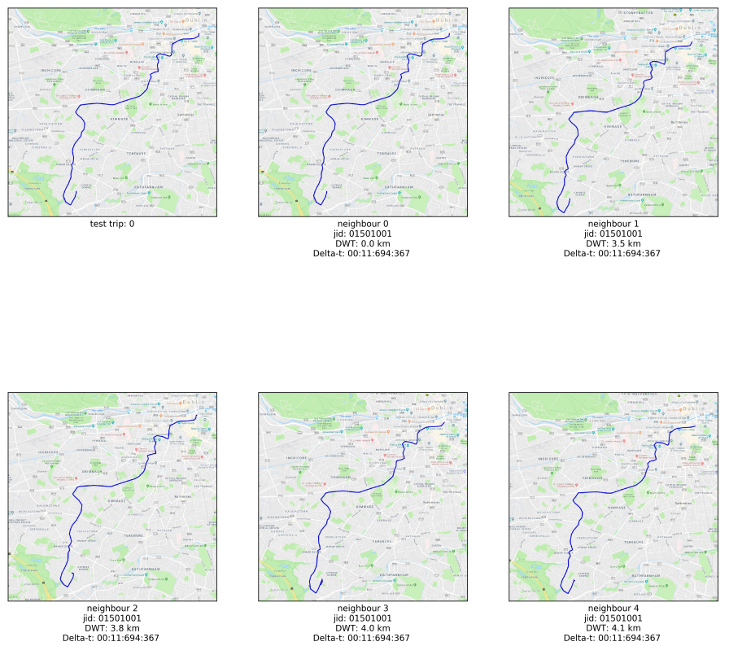
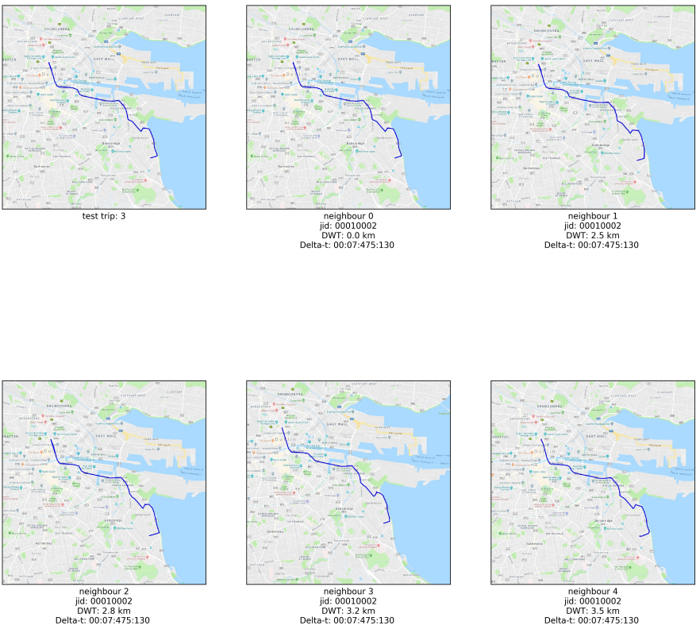
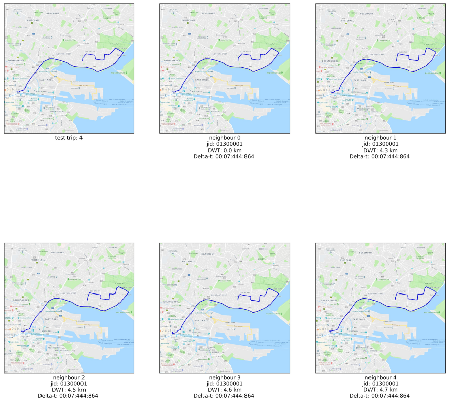
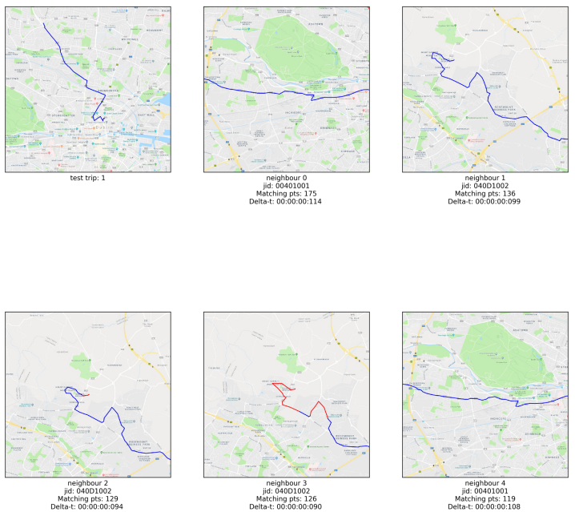
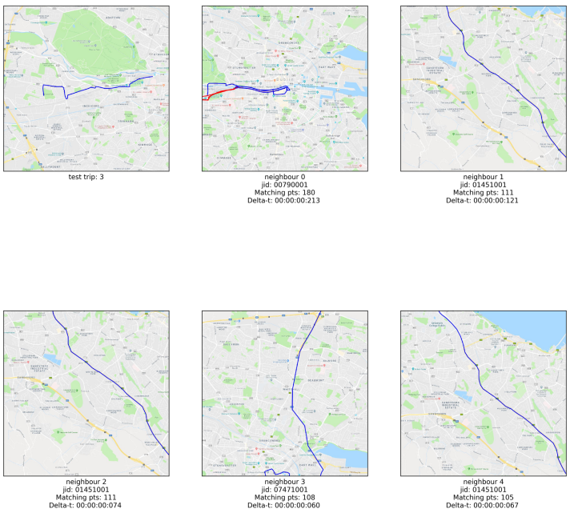
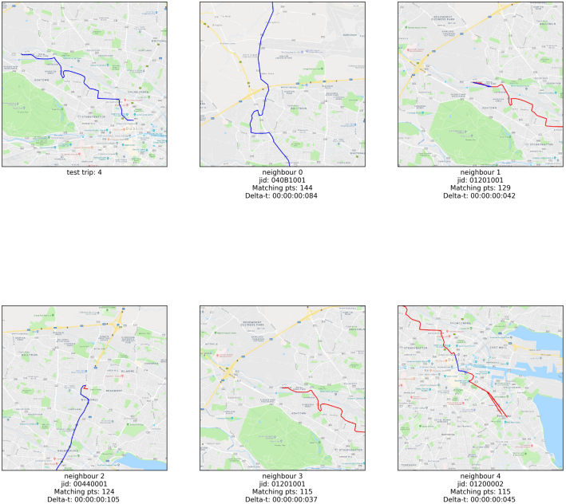
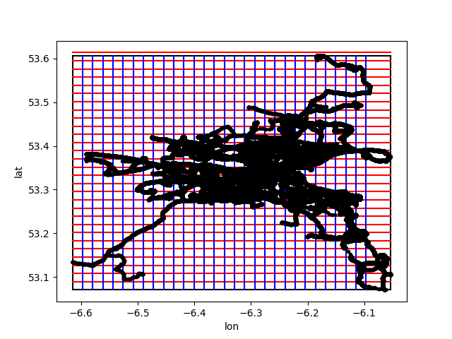

# Project Report

## Introduction

This is the report related to the Python project for the course "Large-Scale Data Analysis Techniques". In the below sections, the implemented logic will be explicitly analyzed. The project is divided in two parts: in the first part the goals are: to preprocess and clean the given data as well as to visualize five of the given trips in the train\_set file. In the second part, the tasks are: to find for all test trips the k nearest neighbors from the given train trips, to find the train trips with the longest similar sub-route for each test trip, to use 10-fold cross validation to the training data and classify them with three different methods (k-nearest neighbors, logistic regression and random forest), to choose one of the above classification methods and improve the result and finally to test the classifier on some given test data.
    
 In the main.py file, it is required to provide the path to the input folder (containing the training and test files) and the output folder where all results will be stored. Afterwards, an object containing all the necessary for the program options is created. This object includes options such as the given input and output directories, the train and the required test files, the number of cells in the grid to be constructed, the number of nearest neighbors etc. There are two ways in order to run this project, either add these folders in the edit configurations choice from the menu, or use the run.sh in order to provide these args. Finally, the dependencies are checked and the folders and files are prepared before starting to run the application.

  Some unclear points in the project instructions where dealt with respective variables and multiple implementations. These points where:
  
* Unique journey ids in subroutes (unique_jids parameter, default true.)
* Consequtive common subsequences (conseq_lcss parameter,default true.)

## Exercise 1

### Data Preprocessing (question A)

The goal in this part is to preprocess the input training data and create a new file with 3 columns:

* the trip\_id (a number incrementing by 1 for each trip)
* the journey\_id(excluding trips with null id)
* all points and timestamps in the format: [[timestamp1, longitude1,latitude1], [timestamp2, longitude2, latitude2],...]

 The given csv file with the training data was transformed to a dataframe using the pandas library. Data with null journey ids are removed from the dataframe, therefore lines with NaN or "null" journey ids are discarded. Then, we iterate in dataframes rows and we store the data into a dictionary having as key the vehicleId and as value the data in the requested format i.e. [journeyId, [timestamp, longitude, latitude]]. In each iteration we check if the vehicleId is in the dictionary (otherwise we add it) and if the current journeyId is the one stored in the dictionary for this vehicleId. If this is true, we append the data list otherwise we create a new trip in the trips list and we delete those data from the dictionary, starting a new trip for the specific vehicle.
  
  After having collected all the trips, we have created three different lists (tripIds, jids and points) storing the trip ids, the journey ids and the points respectively for each trip. Then we have creating three different dataframes from each list and by concatenating them the final dataframe was creating, which was exported in the file trips.csv.
  
### Clean Data (question B)

We clean the given data based on two criteria:

* the total trip distance should not be less than 2km
* the max distance between two successive points should not exceed 2km

The above logic is implemented in function filter\_trips. The two lists (trips\_too\_small and trips\_too\_big) will keep the trips discarded due to the aforementioned criteria. For each trip in the training dataset the total distance is calculated using the function calculate_total_distance, which uses the calculate\_lonlat\_distance function that returns the distance between two points using the haversine formula. Using these functions we compute the required distances and discard the trips that match the exclusion criteria.
	
The resulting filtered trips are stored in the file trips\_clean.csv. The total number of filtered trips is 6020 (192 are deleted due to having total distance less than 2km while 439 are excluded due having to max distance between two points more than 2km).

### Trip Visualization (question C)

This trip visualization task is implemented in the function visualize\_trips and the created output is stored in the output folder in the gmplot directory. The trips list is shuffled in order to show random items, the first 5 of which are fetched for visualization. For each trip, we generate a tuple of longitudes and latitudes with the function utils.idx\_to\_lonlat which we pass on to the plotting function utils.write\_group\_gml. There, the longitude and latitude means are calculated as a visualization centroid for the produced map, and the gmplot library is used so as to visualize the respective point sequence. See the following figure for a visualization example. 

## Exercise 2

This exercise is implemented in the file question2.py and some functions implementing the logic for this question are in the files: NearestNeighbors.py, NearestSubroutes.py, MapInGridView, JourneyClassification.py.

### Nearest Neighbors (question A1)

For this part, a test file is given (test\_set\_a1.csv, included in the input folder) containing additional test trip data. For each test trip, the k nearest neighbors are extracted (in this exercise k=5) and an image file is produced, showing all six trips (the test trip and its 5 neighbour trips from the training file) on six different maps. Under each map, the test or neighbor index, the journey\_id, the dynamic time warping and the time needed to process the neighbors of this test trip in millisecond.

In the function question\_a1, two dataframes are created for both the test and the training trips. For each test trip, {calculate\_nns from the file NearestNeighbors.py is called in order to get the nearest neighbors with respect to all training trips, calculating also the time needed for this calculation.

In calculate\_nns, we explored parallelization options to compute the neighbours, due to the computational intensivenes of the task.

* using multiple processes (run\_with\_processes function) with the multiprocessing module, where an async task is executed for each process.
* multiple threads (run\_with\_threads function) with the threading module, where the task is broken to multiple threads with separate result containers.
* standard serial execution, where each training datum is examined iteratively.

This parallelization type and parameter (i.e. number of processes or threads) is contained in tie paropts variable in main.

In the function calculate\_dists, the 3rd column of the dataframe is provided and In the function, each training trip's time series data is transformed to a list of (longitude, latitude) tuples, which is passed to the calculate\_dynamic\_time\_warping function to calculate the DTW distance. The latter is computed using the harvesine distance calculation function and the DTW wikipedia lemma. The resulting list contains the training instance information along with its distance to the test trip. Sorting the list to increasing distance and keeping its k first elements provides the k nearest neighbours.
	
To visualize the neighbours, the visualize\_nns function is used, where three lists are created:

* a list with all the route points (longitudes and latitudes) of the test trip and its neighbours
* a list with the journey labels and the nn computation data
* a list with the colors with which to draw (all blue in this question)

All this data is provided to the utils.visualize\_point\_sequences function. This function is supplied with point sequences with corresponding color sequences, and produces colored gml plot maps with the write\_group\_gml function. Each html output map is converted to a png image using a conversion tool in the html\_to\_png function, in order to automate image creation from the generated maps (the tool is the rasterize.js utility from the phantomjs module). However we found the gml plot zoom difficult to automatically configure correctly so that all points are visible, and thus the images in the report were fetched with a printscreen. The converted images are used to create 6 subplots (1 test trip + k=5 nearest neighbours). All plotting is done with the pylab package.

In order to improve time performance, we have used a cache strategy exploiting the commutative property of the distance between two points. Therefore, we have used a dictionary storing a mapping of the point pair indices (i,j) as well as (j,i).

Below we present the results from this question in the requested format:

| Test id |    Time    |  id1 |  d1 |  id2 | d2  | id3  | d3  | id4  |  d4 |  id5 |  d5 |
|---------|:----------:|:----:|:---:|:----:|-----|------|-----|------|:---:|:----:|:---:|
| 1       | 11:694:365 | 4139 | 0.0 | 1756 | 3.5 | 584  | 3.8 | 3119 | 4.0 | 3428 | 4.1 |
| 2       | 05:358:252 | 1554 | 0.0 | 6461 | 2.8 | 1985 | 3.4 | 611  | 3.4 | 1434 | 3.5 |
| 3       | 12:732:353 | 3317 | 0.0 | 1939 | 4.7 | 3200 | 4.8 | 5374 | 4.8 | 1508 | 4.8 |
| 4       | 07:475:129 |  603 | 0.0 |  559 | 2.5 | 951  | 2.8 | 1118 | 3.2 |  684 | 3.5 |
| 5       | 07:444:862 | 1497 | 0.0 | 1688 | 4.3 | 927  | 4.5 | 2578 | 4.6 | 6252 | 4.7 |

### Nearest Sub-routes (question A2)

Following the same logic as above, in the function question\_a2 we compute the nearest subroutes of each test trip with the following key differences:

* Instead of DTW, we use the LCSS algorithm in the calc\_lcss method, using the harvesine formula for pointwise distance as before. Give a test and train point sequence, the LCSS function returns a list of all common subsequence points and indexes of the two sequence inputs. The parameter unique\_jids controls wether more than one subsequence is allowed per training trip (default false). Based on the exercise requirements, two points are considered as equals if their distance is less than 200 metres.

* The collection of longest subsequences is updated on-line in the update\_current\_maxsubseq function. Each new subsequences list from a training trip is sorted length-wise, and the current max k subsequences list is updated accordingly (i.e. if there is enough space or if thew new entries are longer than existing ones). Special care is taken to keep unique journey ids, if the unique\_jids is activated.

Finally, a similar data preparation is followed as with the nearest neighbour case to visualize the data. For each training trip, the points belonging to the subroute are colored red, while the others are plotted in blue, by storing corresponding point lists and colors to lists. The required metadata are supplied as labels to the utils.visualize\_point\_sequences function, as before.
	
Below, we present the nearest subroutes for each given test trip:

As in the Nearest Neighbours case, we have also included the html files in the gmplot folder. The automated way with phantomjs does not work always correctly and in above images the red points are not included in the images. However, in html files, all the common points are presented. In the below table we show the total results for Nearest Subroutes.

| Test id |    Time    |  id1 | d1 |  id2 | d2 | id3  | d3 | id4  | d4 |  id5 | d5 |
|---------|:----------:|:----:|:--:|:----:|----|------|----|------|:--:|:----:|:--:|
| 1       | 05:346:265 |  211 | 31 |  728 | 31 | 3590 | 22 | 4985 | 21 |  843 | 19 |
| 2       |  01:63:755 | 2620 | 42 |  510 | 37 | 1093 | 34 | 426  | 31 |  363 | 30 |
| 3       |  00:32:319 |  200 | 40 | 1885 | 40 | 2763 | 40 | 142  | 39 |  135 | 35 |
| 4       |  00:46:297 |  566 | 32 | 1269 | 21 | 227  | 20 | 2561 | 17 |  252 | 15 |
| 5       |  00:57:303 |  940 | 33 | 1932 | 22 | 1384 | 21 | 1606 | 21 | 1822 | 20 |

### Feature extraction (question B)

The purpose of this task was to extract features for classification from the training dataset. In short, a quantization grid should be created and the points of each trip trace should be replaced by a specific square of the grid. The output file where the exported features are stored is tripFeatures.csv.
	
The grid is assumed to be rectangular, with dimensions specified in the options dictionary. In order to be able to draw the grid, we find the min and max
longitudes and latitudes (function: find\_min\_max\_latlong, file: MapInGridView.py). The next function called is the create\_grid, parameterized with the discovered bounds and the grid dimensions. The next step is to create the lines of the rows and the columns and then to provide a name for each cell. The training points and grid structure is visualized with the visualize\_grid function, and illustrated in the figures below.

Feature construction uses the bag-of-words technique with the map\_to\_features\_bow function. A histogram vector is initialized to zeros for each trip, and each coordinate point in the trip is mapped to a grid cell as a function of the grid rows, grid columns and the point's coordinates (funtion find\_cell\_index). This assignment increases the accumulation on that cell in the histogram vector. In addition, in order to keep the direction as feature (to characterize trips with different journeyId and direction but with similar points) we check the first and last point of each trip. If the first point has greater longitude we store all features as negative numbers(in case that the longitude is the same, we check the latitude). The resulting feature fectors are saved in a csv file.

### Classification (question C)

All functions used in this question are in the file JourneyClassification.py. In the method question\_c, a new dataframe is created from the features file, containing the quantized features. Data is prepared for classification in the method preprocess\_train\_data. There, data is shuffled and the target
  journey ids are uniquely mapped to integers to serve as target classes.

The train function uses the numpy scikit-learn libraries to perform training. Data are converted to numpy arrays, partitioned to K=10 cross-validation folds and training is performed for each fold using the appropriate scikit-learn implementations for the Logistic Regression, Random Forests K-Nearest Neighbours (K=5) classifiers and the cross-validation itself. In summary, each classifier is implemented as an object, is trained and evaluated with the fit and predict functions respectively. Prediction produces the predicted classes in all classifiers but the Logistic Regression, which outputs class probabilities - there, the predicted class index is extracted by considering the argmax of the output. Training and validation accuracy is collected per fold and classifier with the accuracy\_score function of scikit-learn, both illustrated in a barchart, constructed using pylab and matplotlib. The mean accuracies accross folds is returned and printed.
  
For beating the benchmark we have selected the Random Forest classifier, and attempted to improve its performance by the following techniques:

* Experimenting with the number of trees in the forest by changing the estimator number(5,20,25) - the default number was 10.
* Changing the max features number to be considered when looking for the best split. The tested stategies are: sqrt, log2, None while the default strategy tested in baseline was the auto strategy.
* Experimenting with the max depth strategy of the tree, with values 10,50 and 100 while the default value was 2.

  Results for all methods are in the table below.
  
  
  | Classifier          | Train Accuracy | Validation Accuracy |
|---------------------|:--------------:|:-------------------:|
| knn                 |      0.904     |        0.861        |
| Logistic Regression |      0.874     |        0.831        |
| Random Forest       |      0.995     |        0.883        |

|     Strategy     | Validation Accuracy |  Change |
|:----------------:|:-------------------:|:-------:|
|    Estimator=5   |        0.865        |  -1.92% |
|   Estimator=20   |        0.893        |  1.19%  |
|    Estimator=5   |        0.894        |  1.30%  |
| Max feature sqrt |        0.882        |  0.00%  |
| Max feature log2 |        0.884        |  0.23%  |
| Max feature None |        0.882        |  0.00%  |
|   Max depth=10   |        0.661        | -25.04% |
|   Max depth=50   |        0.879        |  -0.34% |
|   Max depth=100  |        0.885        |  0.34%  |
|   Min samples=4  |        0.883        |  0.08%  |
|   Min samples=6  |        0.888        |   0.58  |
|  Min samples=10  |        0.884        |   0.21  |

Since we had small improvement with Random Forest classifier, we decided to improve also Logistic Regression classifier. In order to improve its performance we have used the following techniques:

* Feature normalization, where we reduce the variance in the data by applying feature normalization techniques, using the L\_1, L\_2 and max norms.
* Feature scaling, where the features are scaled to zero mean and unit variance.
* Varying the regularization term (C) in the Logistic Regression hyperplane to attempt to find a better fit in the data. We tested values from 0.2 to 2.
* Replace the bag-of-words feature with the VLAD (Vector of Locally Aggregated Descriptors) feature. In VLAD, instead of considering frequency histograms, we accumulate difference from the representative elements in the quantization vector. For example, if a point $p$ is assigned to cell c\_n, in bag-of-words the n-th coordinate in the quantization vector is incremented by 1. In VLAD, the increment equals d(p,c_n), where d is a distance function. We used the cell centroid as the cell representative point and the harvesine distance.

Below we show the results from the techniques used for the Logistic Regression classifier:

| Strategy | Validation Accuracy |  Change |
|:--------:|:-------------------:|:-------:|
|  L1 norm |        0.794        |  -4.56% |
|  L2 norm |        0.616        | -25.93% |
| max norm |        0.790        |  -4.98% |
|  scaling |        0.832        |  0.12%  |
|  C 0.200 |        0.834        |  0.34%  |
|  C 0.500 |        0.833        |  0.18%  |
|  C 1.500 |        0.831        |  -0.02% |
|  C 2.000 |        0.831        |  -0.02% |

All above techniques were implemented using a 20x20 grid. We have also tried to increase the size of grid to 50x50 and 30x30 but the results were worse. Therefore we have decided to keep the 20x20 grid. All the results are included in the runlog file. In addition, in the folder classification\_charts, we have included all the histograms  showing the performance of all tested classifiers.

#### Test improved classifier

We tested the improved classifier in the test data. The results are attached in the specified format to the file testSet\_journeyPatternIDs.csv.